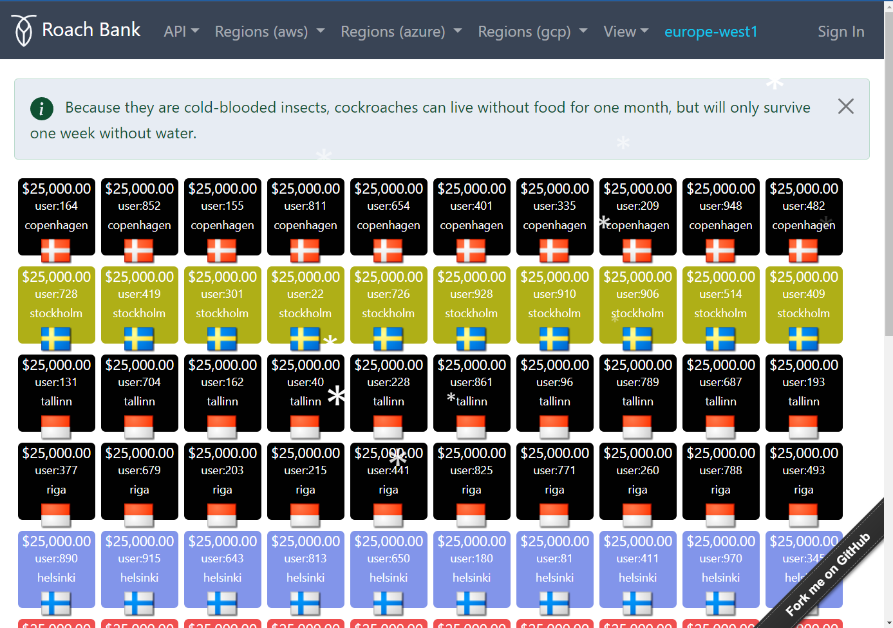

# Deploy Roach Bank into Kubernetes

Roach Bank represents a full-stack, financial accounting ledger demo running on [CockroachDB](https://www.cockroachlabs.com/)
and PostgreSQL. It's designed to demonstrate the safety and liveness properties of a globally deployed, 
system-of-record type of workload.

# Introduction

The concept of the ledger is to move funds between accounts using balanced, multi-legged transactions 
at a high frequency. As a financial system, it needs to conserve money at all times and also provide 
an audit trail of all transactions performed towards the accounts.

This is visualized (below) using a single page to display accounts as rectangles with their current
balance.



```
clus1="crdb-aks-uksouth"
clus2="crdb-aks-ukwest"
clus3="crdb-aks-northeurope"
loc1="uksouth"
loc2="ukwest"
loc3="northeurope"
```

# Deployment

See the [Deployment Guide](deploy/README.md) on how to deploy the ledger to a multi-region Kubernetes cluster.

# Demo 1 CockroachDB Resilience

The first demo will show how CockroachDB is able to survive a single node outage as well as a complete region outage as well.

[Demo 1](resiliancey/README.md)

# Demo 2 CockroachDB Scalability

The second demo shows how CockroachDB can scale elastically to accommodate additional load.

[Demo 2](scalability/README.md)

# Clean Up

Scale the deployments to zero to save cost. Scale the client first.
```
kubectl scale deployment bank-client --replicas=0 -n roach-bank --context $clus1
kubectl scale deployment bank-client --replicas=0 -n roach-bank --context $clus2
kubectl scale deployment bank-client --replicas=0 -n roach-bank --context $clus3
```
Scale the server
```
kubectl scale deployment bank-server --replicas=0 -n roach-bank --context $clus1
kubectl scale deployment bank-server --replicas=0 -n roach-bank --context $clus2
kubectl scale deployment bank-server --replicas=0 -n roach-bank --context $clus3
```

Return to starting config. Remove the nodes one at a time, starting with the first cluster.
```
kubectl scale statefulsets cockroachdb --replicas=5 -n $loc1 --context $clus1
```
Wait until the cluster to have 0 under replicated ranges.


Remove the next node, and wait until the cluster to have 0 under replicated ranges.
```
kubectl scale statefulsets cockroachdb --replicas=4 -n $loc1 --context $clus1
```

Remove the next node, and wait until the cluster to have 0 under replicated ranges.
```
kubectl scale statefulsets cockroachdb --replicas=3 -n $loc1 --context $clus1
```

Delete nodes from the second region once the cluster has recovered. One by one.
```
kubectl scale statefulsets cockroachdb --replicas=5 -n $loc2 --context $clus2
```
```
kubectl scale statefulsets cockroachdb --replicas=4 -n $loc2 --context $clus2
```
```
kubectl scale statefulsets cockroachdb --replicas=3 -n $loc2 --context $clus2
```

Delete nodes from the third region once the cluster has recovered. Again, one by one.
```
kubectl scale statefulsets cockroachdb --replicas=5 -n $loc3 --context $clus3
```

```
kubectl scale statefulsets cockroachdb --replicas=4 -n $loc3 --context $clus3
```

```
kubectl scale statefulsets cockroachdb --replicas=3 -n $loc3 --context $clus3
```

Delete the PVC for the removed nodes.
```
kubectl delete pvc datadir-cockroachdb-3 datadir-cockroachdb-4 datadir-cockroachdb-5 -n $loc1 --context $clus1
kubectl delete pvc datadir-cockroachdb-3 datadir-cockroachdb-4 datadir-cockroachdb-5 -n $loc2 --context $clus2
kubectl delete pvc datadir-cockroachdb-3 datadir-cockroachdb-4 datadir-cockroachdb-5 -n $loc3 --context $clus3
```

Remove the the dead nodes. CHECK NODE NUMBERS IN THE UI!!!
```
kubectl exec -it cockroachdb-client-secure -n $loc1 --context $clus1 -- ./cockroach node decommission <node numbers> --certs-dir=/cockroach-certs --host=cockroachdb-public
```

Scale Roach Bank to zero, first with the client.
```
kubectl scale deployment bank-client --replicas=0 -n roach-bank --context $clus1
kubectl scale deployment bank-client --replicas=0 -n roach-bank --context $clus2
kubectl scale deployment bank-client --replicas=0 -n roach-bank --context $clus3
```
Then the server. This will conserve resources. 
```
kubectl scale deployment bank-server --replicas=0 -n roach-bank --context $clus2
kubectl scale deployment bank-server --replicas=0 -n roach-bank --context $clus3
kubectl scale deployment bank-server --replicas=0 -n roach-bank --context $clus1
```

If you need to ever perform a rolling re-start of the cockroachdb pods this is how.

Perform a rolling restart of pods in each statfulset. One region at a time.
```
kubectl rollout restart statefulsets cockroachdb -n $loc1 --context $clus1
```
Once region 1 is completed do region 2.
```
kubectl rollout restart statefulsets cockroachdb -n $loc2 --context $clus2
```
Once region 2 is complete do region 3.
```
kubectl rollout restart statefulsets cockroachdb -n $loc3 --context $clus3
```